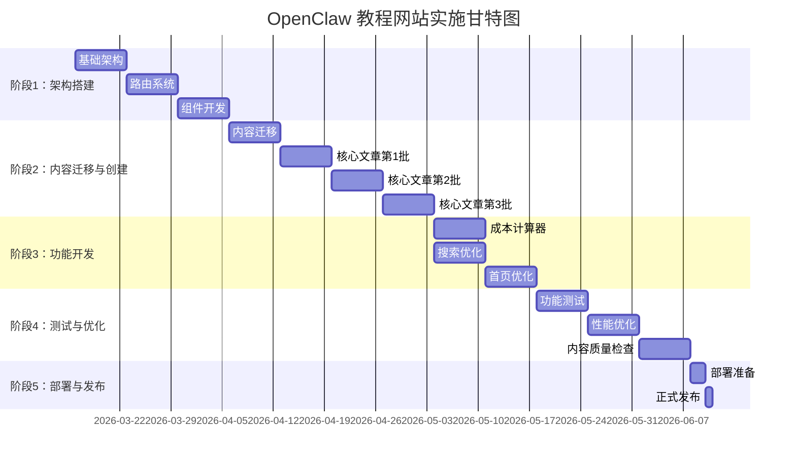

# OpenClaw 教程网站 - 实施路线图

## 项目概览

**目标**：将 OpenClaw 教程网站从简单的博客架构升级为完整的多页面教程平台

**预计总时长**：8-12 周

**团队规模**：1-2 名开发者

## 阶段划分

### 阶段 1：架构搭建（第 1-3 周）

**目标**：建立新的页面架构和组件系统

#### 1.1 基础架构（第 1 周）

**任务清单**：

- [ ] **扩展 Content Collections Schema**
  - 文件：`src/content/config.ts`
  - 新增字段：`category`, `subcategory`, `order`, `relatedPosts`, `prevPost`, `nextPost`, `featured`, `status`
  - 预计时间：4 小时

- [ ] **创建新的布局文件**
  - `src/layouts/TutorialLayout.astro` - 教程专用布局
  - `src/layouts/PageLayout.astro` - 普通页面布局
  - `src/layouts/SearchLayout.astro` - 搜索页面布局
  - 预计时间：8 小时

- [ ] **创建核心组件**
  - `src/components/Navigation.astro` - 顶部导航（支持多级菜单）
  - `src/components/Breadcrumb.astro` - 面包屑导航
  - `src/components/Sidebar.astro` - 侧边栏（用于教程目录）
  - 预计时间：12 小时

- [ ] **更新基础布局**
  - 文件：`src/layouts/Layout.astro`
  - 添加固定的顶部导航
  - 添加页脚
  - 优化响应式设计
  - 预计时间：6 小时

**里程碑**：✅ 基础架构完成，新组件可用

#### 1.2 路由系统（第 2 周）

**任务清单**：

- [ ] **创建教程路由结构**
  - `src/pages/tutorials/index.astro` - 教程总览页
  - `src/pages/tutorials/[category]/[slug].astro` - 动态教程页
  - `src/pages/zh-cn/tutorials/` - 中文版路由
  - 预计时间：10 小时

- [ ] **创建安装部署路由**
  - `src/pages/installation/index.astro` - 安装总览页
  - `src/pages/installation/[slug].astro` - 安装文章页
  - 中文版路由
  - 预计时间：6 小时

- [ ] **创建疑难解答路由**
  - `src/pages/troubleshooting/index.astro` - 疑难解答总览
  - `src/pages/troubleshooting/faq.astro` - FAQ 页面
  - `src/pages/troubleshooting/github-issues.astro` - GitHub Issues 页
  - 中文版路由
  - 预计时间：8 小时

- [ ] **创建功能页面路由**
  - `src/pages/cost-calculator/index.astro`
  - `src/pages/community/index.astro`
  - `src/pages/community/clawhub.astro`
  - `src/pages/community/github.astro`
  - `src/pages/community/downloads.astro`
  - 中文版路由
  - 预计时间：8 小时

**里程碑**：✅ 所有路由创建完成，页面可访问

#### 1.3 组件开发（第 3 周）

**任务清单**：

- [ ] **开发教程相关组件**
  - `src/components/TutorialCard.astro` - 教程卡片组件
  - `src/components/TableOfContents.astro` - 文章目录组件
  - `src/components/TutorialNav.astro` - 教程导航（上一篇/下一篇）
  - 预计时间：10 小时

- [ ] **开发成本计算器**
  - `src/components/CostCalculator.astro`
  - 表单输入：模型选择、部署环境、使用量
  - 实时计算：API 调用成本、存储成本
  - 使用 Alpine.js 或 Vue.js 实现交互
  - 预计时间：12 小时

- [ ] **优化搜索功能**
  - 增强 `src/components/BugSearch.astro`
  - 添加分类筛选
  - 添加标签筛选
  - 优化搜索结果展示
  - 预计时间：8 小时

- [ ] **开发辅助组件**
  - `src/components/Pagination.astro` - 分页组件
  - `src/components/TagCloud.astro` - 标签云
  - `src/components/ProgressBar.astro` - 学习进度条（可选）
  - 预计时间：6 小时

**里程碑**：✅ 所有核心组件开发完成

### 阶段 2：内容迁移与创建（第 4-7 周）

**目标**：迁移现有内容并创建核心文章

#### 2.1 内容迁移（第 4 周）

**任务清单**：

- [ ] **备份现有内容**
  ```bash
  # 执行备份
  ```
  - 预计时间：1 小时

- [ ] **更新现有文章 frontmatter**
  - 添加 `category` 字段
  - 添加 `order` 字段
  - 更新 `alternates` 路径
  - 14 篇英文文章 + 14 篇中文文章
  - 预计时间：6 小时

- [ ] **移动文件到新位置**
  - 按照映射方案移动文件
  - 更新文件名（如需要）
  - 预计时间：3 小时

- [ ] **创建重定向规则**
  - 保留 `src/pages/posts/[slug].astro` 用于重定向
  - 设置 301 重定向
  - 预计时间：4 小时

- [ ] **测试迁移结果**
  - 测试所有旧链接
  - 测试新路由
  - 测试语言切换
  - 预计时间：4 小时

**里程碑**：✅ 现有内容迁移完成，无损坏链接

#### 2.2 创建核心文章 - 第 1 批（第 5 周）

**优先级：P0**

**01 新手上路**（5 篇）：
- [ ] `model-integration.md` - 模型接入指南
- [ ] `channel-feishu.md` - 飞书集成
- [ ] `channel-wechat.md` - 微信集成
- [ ] `channel-qq.md` - QQ 集成
- [ ] `channel-wecom.md` - 企业微信集成

**02 初始化小龙虾**（4 篇）：
- [ ] `agents-config.md` - AGENTS.md 详解
- [ ] `user-config.md` - USER.md 详解
- [ ] `soul-config.md` - SOUL.md 详解
- [ ] `environment-variables.md` - 环境变量配置

**预计时间**：每篇 2-3 小时，共 18-27 小时

**里程碑**：✅ 新手入门内容完成

#### 2.3 创建核心文章 - 第 2 批（第 6 周）

**优先级：P0**

**安装部署**（4 篇）：
- [ ] `cloud-aliyun.md` - 阿里云部署
- [ ] `cloud-tencent.md` - 腾讯云部署
- [ ] `cloud-volcano.md` - 火山引擎部署
- [ ] `one-click-deployment.md` - 一键部署平台

**06 必备技能包（新手必备）**（4 篇）：
- [ ] `basic-conversation.md` - 基础对话技巧
- [ ] `common-commands.md` - 常用命令速查
- [ ] `log-viewing.md` - 日志查看和分析
- [ ] `basic-troubleshooting.md` - 问题排查基础

**疑难解答 FAQ**（1 篇）：
- [ ] `faq.md` - 20 个常见问题

**预计时间**：每篇 2-3 小时，共 18-27 小时

**里程碑**：✅ 安装部署和基础技能内容完成

#### 2.4 创建核心文章 - 第 3 批（第 7 周）

**优先级：P0**

**03 小龙虾的眼睛**（3 篇）：
- [ ] `vision-basics.md` - 视觉能力基础
- [ ] `image-processing.md` - 图像处理入门
- [ ] `multimodal-models.md` - 多模态模型配置

**04 小龙虾的手脚**（3 篇）：
- [ ] `tool-calling-basics.md` - 工具调用基础
- [ ] `api-integration.md` - API 集成入门
- [ ] `function-calling.md` - Function Calling 实战

**05 小龙虾的大脑**（3 篇）：
- [ ] `memory-system.md` - 记忆系统基础
- [ ] `vector-database.md` - 向量数据库配置
- [ ] `context-management.md` - 上下文管理

**07 多 Agents 能力（基础）**（4 篇）：
- [ ] `multi-agent-architecture.md` - 多 Agent 架构概述
- [ ] `creating-multiple-agents.md` - 创建多个 Agent
- [ ] `agent-communication.md` - Agent 间通信
- [ ] `collaboration-patterns.md` - 协作模式

**预计时间**：每篇 3-4 小时，共 39-52 小时

**里程碑**：✅ 核心能力内容完成

### 阶段 3：功能开发（第 8-9 周）

**目标**：开发交互功能和优化用户体验

#### 3.1 成本计算器开发（第 8 周）

**任务清单**：

- [ ] **设计计算逻辑**
  - 定义成本计算公式
  - 收集各平台定价信息
  - 预计时间：4 小时

- [ ] **实现前端界面**
  - 表单设计（模型、环境、用量）
  - 结果展示
  - 图表可视化（可选）
  - 预计时间：8 小时

- [ ] **实现计算功能**
  - API 成本计算
  - 存储成本计算
  - 网络传输成本计算
  - 预计时间：6 小时

- [ ] **测试和优化**
  - 边界情况测试
  - 性能优化
  - 预计时间：4 小时

**里程碑**：✅ 成本计算器功能完成

#### 3.2 搜索功能优化（第 8 周）

**任务清单**：

- [ ] **增强 BugSearch 组件**
  - 添加分类筛选
  - 添加标签筛选
  - 添加难度筛选
  - 预计时间：6 小时

- [ ] **优化搜索算法**
  - 改进相关性排序
  - 添加模糊搜索
  - 预计时间：4 小时

- [ ] **优化搜索结果展示**
  - 添加高亮显示
  - 添加搜索建议
  - 预计时间：4 小时

**里程碑**：✅ 搜索功能优化完成

#### 3.3 首页优化（第 9 周）

**任务清单**：

- [ ] **重新设计首页**
  - Hero 区域优化
  - 添加教程分类卡片
  - 添加最新文章列表
  - 添加快速链接
  - 预计时间：8 小时

- [ ] **实现交互功能**
  - 平滑滚动
  - 动画效果
  - 响应式优化
  - 预计时间：6 小时

- [ ] **添加社区与资源区域**
  - ClawHub 链接
  - GitHub 链接
  - 资源下载
  - 预计时间：4 小时

**里程碑**：✅ 首页优化完成

### 阶段 4：测试与优化（第 10-11 周）

**目标**：全面测试和性能优化

#### 4.1 功能测试（第 10 周）

**任务清单**：

- [ ] **链接测试**
  - 检查所有内部链接
  - 检查外部链接
  - 检查语言切换链接
  - 预计时间：4 小时

- [ ] **路由测试**
  - 测试所有动态路由
  - 测试重定向
  - 测试 404 页面
  - 预计时间：3 小时

- [ ] **表单测试**
  - 测试成本计算器
  - 测试搜索功能
  - 测试表单验证
  - 预计时间：3 小时

- [ ] **跨浏览器测试**
  - Chrome
  - Firefox
  - Safari
  - Edge
  - 移动浏览器
  - 预计时间：4 小时

**里程碑**：✅ 功能测试完成

#### 4.2 性能优化（第 10-11 周）

**任务清单**：

- [ ] **页面性能优化**
  - 图片优化（使用 Astro Image）
  - 代码分割
  - 懒加载
  - 预计时间：6 小时

- [ ] **SEO 优化**
  - 添加 meta 标签
  - 添加结构化数据
  - 生成 sitemap
  - 优化 URL 结构
  - 预计时间：4 小时

- [ ] **Lighthouse 优化**
  - 目标：性能 > 90
  - 目标：可访问性 > 90
  - 目标：最佳实践 > 90
  - 目标：SEO > 90
  - 预计时间：6 小时

**里程碑**：✅ 性能优化完成，Lighthouse 分数达标

#### 4.3 内容质量检查（第 11 周）

**任务清单**：

- [ ] **内容审核**
  - 检查文章准确性
  - 检查代码示例
  - 检查术语一致性
  - 预计时间：8 小时

- [ ] **多语言检查**
  - 检查中英文对应关系
  - 检查翻译质量
  - 检查语言切换
  - 预计时间：4 小时

- [ ] **链接检查**
  - 使用自动化工具检查死链
  - 手动检查重要链接
  - 预计时间：3 小时

**里程碑**：✅ 内容质量达标

### 阶段 5：部署与发布（第 12 周）

**目标**：部署到生产环境

#### 5.1 部署准备（第 12 周）

**任务清单**：

- [ ] **环境配置**
  - 配置 Cloudflare Pages
  - 设置环境变量
  - 配置域名
  - 预计时间：2 小时

- [ ] **构建优化**
  - 优化构建配置
  - 测试构建流程
  - 预计时间：2 小时

- [ ] **预发布测试**
  - 在预发布环境测试
  - 冒烟测试
  - 预计时间：3 小时

**里程碑**：✅ 部署准备完成

#### 5.2 正式发布（第 12 周）

**任务清单**：

- [ ] **部署到生产**
  - 执行部署
  - 验证部署结果
  - 预计时间：1 小时

- [ ] **发布后验证**
  - 检查所有页面
  - 检查功能
  - 检查性能
  - 预计时间：2 小时

- [ ] **监控配置**
  - 配置 Analytics（可选）
  - 配置错误监控（可选）
  - 预计时间：2 小时

**里程碑**：✅ 正式上线

## 依赖关系

### 关键路径



### 依赖关系说明

1. **架构搭建**必须最先完成，是所有后续工作的基础
2. **内容迁移**依赖新的路由系统
3. **文章创建**可以在路由完成后立即开始
4. **功能开发**（成本计算器、搜索优化）可以在内容创建的同时进行
5. **测试与优化**必须在所有功能开发完成后进行
6. **部署与发布**是最后一步

## 风险管理

### 风险识别

1. **时间风险**
   - 风险：文章创作时间超出预期
   - 缓解：优先完成 P0 级别文章，P1/P2 可以后续补充

2. **技术风险**
   - 风险：新组件开发遇到技术难题
   - 缓解：使用成熟的 Astro 组件库，参考现有代码

3. **内容风险**
   - 风险：OpenClaw 功能更新导致文章过时
   - 缓解：建立内容更新机制，定期审查

4. **兼容性风险**
   - 风险：迁移过程中破坏现有功能
   - 缓解：充分测试，保留旧链接重定向

### 应对策略

1. **增量发布**
   - 不要等待所有内容完成才发布
   - 可以分阶段发布新功能

2. **保留回退选项**
   - 保留现有代码的备份
   - 使用 Git 分支管理

3. **灵活调整**
   - 根据实际进度调整优先级
   - 必要时延长某阶段时间

## 质量保证

### 质量标准

1. **代码质量**
   - TypeScript 类型完整
   - 代码风格一致
   - 组件可复用

2. **内容质量**
   - 文章经测试验证
   - 代码示例可运行
   - 术语使用一致

3. **性能质量**
   - Lighthouse 分数 > 90
   - 首屏加载 < 2s
   - 构建 < 5min

4. **用户体验**
   - 响应式设计
   - 导航清晰
   - 语言切换流畅

### 测试计划

1. **单元测试**
   - 组件测试
   - 工具函数测试

2. **集成测试**
   - 路由测试
   - 数据流测试

3. **E2E 测试**
   - 用户流程测试
   - 跨浏览器测试

4. **性能测试**
   - Lighthouse 测试
   - 加载速度测试

## 成功标准

### 阶段性成功标准

**阶段 1**：
- ✅ 所有新路由可访问
- ✅ 导航和面包屑正常工作
- ✅ 构建无错误

**阶段 2**：
- ✅ 现有内容迁移完成
- ✅ 至少 20 篇新文章创建
- ✅ 无死链

**阶段 3**：
- ✅ 成本计算器可用
- ✅ 搜索功能优化
- ✅ 首页用户体验提升

**阶段 4**：
- ✅ 所有测试通过
- ✅ Lighthouse 分数 > 90
- ✅ 无关键 bug

**阶段 5**：
- ✅ 成功部署到生产
- ✅ 所有功能正常
- ✅ 用户反馈良好

### 最终成功标准

1. **功能完整性**
   - 7 个教程分类可访问
   - 安装部署指南完整
   - 疑难解答功能完善
   - 成本计算器可用
   - 社区资源链接正确

2. **内容丰富度**
   - 至少 40 篇教程文章（英文+中文）
   - 覆盖所有核心功能
   - 持续更新机制

3. **用户体验**
   - 导航清晰直观
   - 查找内容方便
   - 语言切换流畅
   - 移动端友好

4. **技术指标**
   - Lighthouse 性能 > 90
   - SEO 评分 > 90
   - 无关键错误
   - 快速加载

## 后续计划

### 短期（上线后 1-2 个月）

1. **内容补充**
   - 完成 P1 级别文章
   - 根据用户反馈调整内容

2. **功能优化**
   - 根据数据分析优化
   - 添加用户请求的功能

3. **社区建设**
   - 收集用户反馈
   - 建立内容贡献机制

### 中期（上线后 3-6 个月）

1. **功能扩展**
   - 添加用户账户系统
   - 添加学习进度跟踪
   - 添加评论功能

2. **内容深化**
   - 添加更多实战案例
   - 添加视频教程
   - 添加互动示例

3. **性能优化**
   - 持续性能监控
   - 定期性能优化
   - CDN 优化

### 长期（6 个月以上）

1. **生态建设**
   - 建立作者社区
   - 建立内容审核机制
   - 建立激励机制

2. **商业化探索**
   - 考虑广告变现
   - 考虑付费内容
   - 考虑企业服务

3. **技术升级**
   - 升级依赖版本
   - 采用新技术
   - 重构老旧代码

## 总结

本实施路线图提供了一个完整的、分阶段的开发计划，涵盖架构搭建、内容创建、功能开发、测试优化和部署发布全过程。

**关键成功因素**：
1. 严格按阶段执行
2. 优先完成核心功能
3. 持续测试和优化
4. 灵活应对变化
5. 保持内容质量

**预计时间线**：
- 第 1-3 周：架构搭建
- 第 4-7 周：内容迁移与创建
- 第 8-9 周：功能开发
- 第 10-11 周：测试与优化
- 第 12 周：部署与发布

**关键里程碑**：
1. ✅ 基础架构完成（第 3 周）
2. ✅ 核心内容完成（第 7 周）
3. ✅ 功能开发完成（第 9 周）
4. ✅ 测试优化完成（第 11 周）
5. ✅ 正式上线（第 12 周）
