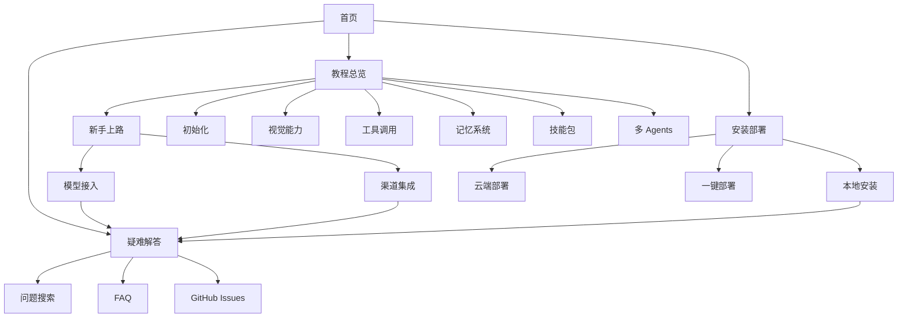

# OpenClaw 教程网站 - 多页面架构设计方案

## 1. 页面结构树

### 1.1 完整路由设计

```
/ (英文首页)
├── /tutorials/ (教程总览页)
│   ├── /01-getting-started/ (新手上路)
│   │   ├── model-integration.md (模型接入)
│   │   ├── channel-feishu.md (飞书集成)
│   │   ├── channel-wechat.md (微信集成)
│   │   ├── channel-qq.md (QQ 集成)
│   │   └── channel-wecom.md (企业微信集成)
│   ├── /02-initialization/ (初始化小龙虾)
│   │   ├── agents-config.md (AGENTS.md 配置)
│   │   ├── user-config.md (USER.md 配置)
│   │   └── soul-config.md (SOUL.md 配置)
│   ├── /03-claw-eyes/ (小龙虾的眼睛)
│   │   ├── vision-basics.md (视觉基础)
│   │   ├── image-processing.md (图像处理)
│   │   └── video-understanding.md (视频理解)
│   ├── /04-claw-hands/ (小龙虾的手脚)
│   │   ├── tool-calling.md (工具调用)
│   │   ├── api-integration.md (API 集成)
│   │   └── automation.md (自动化)
│   ├── /05-claw-brain/ (小龙虾的大脑)
│   │   ├── memory-system.md (记忆系统)
│   │   ├── collaboration.md (协作机制)
│   │   └── context-management.md (上下文管理)
│   ├── /06-essential-skills/ (必备技能包)
│   │   ├── /beginner/ (新手必备)
│   │   ├── /developer/ (开发者热门)
│   │   ├── /media/ (自媒体热门)
│   │   └── /general/ (热门通用)
│   └── /07-multi-agents/ (多 Agents 能力)
│       ├── /basic/ (基础入门)
│       └── /advanced/ (进阶技巧)
├── /installation/ (安装部署)
│   ├── local-mac.md (macOS 本地安装)
│   ├── local-linux.md (Linux 本地安装)
│   ├── local-windows.md (Windows 本地安装)
│   ├── cloud-aliyun.md (阿里云部署)
│   ├── cloud-tencent.md (腾讯云部署)
│   ├── cloud-volcano.md (火山引擎部署)
│   └── one-click-deployment.md (一键部署平台汇总)
├── /troubleshooting/ (疑难解答)
│   ├── /search/ (问题搜索页 - 已有 BugSearch)
│   ├── /faq/ (常见问题 20 问)
│   ├── /github-issues/ (GitHub Issues 汇总)
│   └── /doctor/ (诊断工具 - 重新定位现有文章)
├── /cost-calculator/ (成本计算器)
└── /community/ (社区与资源)
    ├── /clawhub/ (ClawHub 社区)
    ├── /github/ (GitHub 仓库)
    └── /downloads/ (资源下载)

/zh-cn/ (中文首页 - 完全镜像结构)
├── /tutorials/ (教程总览页)
│   ├── /01-getting-started/ (新手上路)
│   └── ... (完全对应的中文页面)
├── /installation/ (安装部署)
├── /troubleshooting/ (疑难解答)
├── /cost-calculator/ (成本计算器)
└── /community/ (社区与资源)

/bugs/ (Bug 搜索页 - 已有，保留)
/zh-cn/bugs/ (中文 Bug 搜索页)
```

### 1.2 URL 设计原则

1. **SEO 友好**：使用描述性路径而非 ID
2. **层级清晰**：最多 3-4 层深度
3. **语义化**：URL 可读性强
4. **一致性**：英文和中文路径结构一致
5. **简短合理**：避免过长路径

## 2. 固定顶部导航设计

### 2.1 导航栏结构

```typescript
// 导航菜单配置
interface NavItem {
  label: string;
  labelZhCN: string;
  href: string;
  children?: NavItem[];
  icon?: string;
  badge?: string;
}

const NAVIGATION: NavItem[] = [
  {
    label: 'Tutorials',
    labelZhCN: '教程',
    href: '/tutorials/',
    icon: '📚',
    children: [
      { label: 'Getting Started', labelZhCN: '新手上路', href: '/tutorials/01-getting-started/' },
      { label: 'Initialization', labelZhCN: '初始化', href: '/tutorials/02-initialization/' },
      { label: 'Vision', labelZhCN: '视觉能力', href: '/tutorials/03-claw-eyes/' },
      { label: 'Tools', labelZhCN: '工具调用', href: '/tutorials/04-claw-hands/' },
      { label: 'Memory', labelZhCN: '记忆系统', href: '/tutorials/05-claw-brain/' },
      { label: 'Skills', labelZhCN: '技能包', href: '/tutorials/06-essential-skills/' },
      { label: 'Multi-Agents', labelZhCN: '多 Agents', href: '/tutorials/07-multi-agents/' },
    ],
  },
  {
    label: 'Installation',
    labelZhCN: '安装部署',
    href: '/installation/',
    icon: '⚙️',
    children: [
      { label: 'Local Setup', labelZhCN: '本地安装', href: '/installation/' },
      { label: 'Cloud Deployment', labelZhCN: '云端部署', href: '/installation/#cloud' },
      { label: 'One-Click Platforms', labelZhCN: '一键部署', href: '/installation/one-click-deployment/' },
    ],
  },
  {
    label: 'Troubleshooting',
    labelZhCN: '疑难解答',
    href: '/troubleshooting/',
    icon: '🔍',
    children: [
      { label: 'Search Issues', labelZhCN: '搜索问题', href: '/troubleshooting/search/' },
      { label: 'FAQ', labelZhCN: '常见问题', href: '/troubleshooting/faq/' },
      { label: 'GitHub Issues', labelZhCN: 'GitHub 问题', href: '/troubleshooting/github-issues/' },
    ],
  },
  {
    label: 'Cost Calculator',
    labelZhCN: '成本计算器',
    href: '/cost-calculator/',
    icon: '💰',
  },
  {
    label: 'Community',
    labelZhCN: '社区',
    href: '/community/',
    icon: '👥',
    children: [
      { label: 'ClawHub', labelZhCN: 'ClawHub', href: '/community/clawhub/' },
      { label: 'GitHub', labelZhCN: 'GitHub', href: '/community/github/' },
      { label: 'Downloads', labelZhCN: '资源下载', href: '/community/downloads/' },
    ],
  },
];
```

### 2.2 响应式导航行为

- **桌面端**：水平导航栏，下拉菜单展示子项
- **移动端**：汉堡菜单，侧边抽屉式导航
- **平板端**：适配中等屏幕，优化触摸交互

### 2.3 组件实现建议

```astro
---
// src/components/Navigation.astro
interface Props {
  currentPath: string;
  lang: 'en' | 'zh-CN';
}

const { currentPath, lang } = Astro.props;
const isZhCN = lang === 'zh-CN';
---

<nav class="main-nav sticky">
  <div class="nav-container">
    <a href={isZhCN ? '/zh-cn/' : '/'} class="nav-logo">
      <span class="logo-icon">🦞</span>
      <span class="logo-text">OpenClaw Tutorial</span>
    </a>

    <button class="nav-toggle" aria-label="Toggle navigation">
      <span></span>
      <span></span>
      <span></span>
    </button>

    <ul class="nav-menu">
      <!-- 动态生成导航项 -->
    </ul>

    <div class="nav-actions">
      <LangSwitch currentPath={currentPath} />
    </div>
  </div>
</nav>

<style>
  .main-nav.sticky {
    position: sticky;
    top: 0;
    z-index: 1000;
    background: white;
    box-shadow: 0 2px 4px rgba(0,0,0,0.1);
  }

  /* 响应式设计 */
  @media (max-width: 768px) {
    .nav-menu {
      position: fixed;
      top: 0;
      right: -100%;
      width: 80%;
      height: 100vh;
      background: white;
      transition: right 0.3s ease;
    }

    .nav-menu.active {
      right: 0;
    }
  }
</style>
```

## 3. 页面间链接关系

### 3.1 主要用户路径



### 3.2 文章间导航

- **上一篇/下一篇**：同一分类内的文章导航
- **相关推荐**：基于标签和主题的推荐
- **学习路径**：预设的线性学习顺序

## 4. 面包屑导航设计

### 4.1 面包屑组件

```astro
---
// src/components/Breadcrumb.astro
interface Props {
  items: Array<{
    label: string;
    href: string;
  }>;
  current: string;
}

const { items, current } = Astro.props;
---

<nav class="breadcrumb" aria-label="Breadcrumb">
  <ol class="breadcrumb-list">
    <li class="breadcrumb-item">
      <a href="/">🏠 Home</a>
    </li>
    {items.map((item) => (
      <li class="breadcrumb-item">
        <a href={item.href}>{item.label}</a>
        <span class="breadcrumb-separator">/</span>
      </li>
    ))}
    <li class="breadcrumb-item active" aria-current="page">
      {current}
    </li>
  </ol>
</nav>

<style>
  .breadcrumb {
    padding: 1rem 0;
    margin-bottom: 2rem;
  }

  .breadcrumb-list {
    display: flex;
    list-style: none;
    padding: 0;
    margin: 0;
    flex-wrap: wrap;
  }

  .breadcrumb-item {
    display: flex;
    align-items: center;
    gap: 0.5rem;
  }

  .breadcrumb-separator {
    color: #666;
  }

  .breadcrumb-item.active {
    color: #666;
    font-weight: 500;
  }
</style>
```

### 4.2 面包屑生成逻辑

```typescript
// 根据路径自动生成面包屑
function generateBreadcrumb(path: string, lang: 'en' | 'zh-CN') {
  const segments = path.split('/').filter(Boolean);
  const breadcrumbs: Array<{ label: string; href: string }> = [];

  let currentPath = '';
  for (const segment of segments) {
    currentPath += `/${segment}`;
    breadcrumbs.push({
      label: formatSegment(segment, lang),
      href: currentPath,
    });
  }

  return breadcrumbs;
}
```

## 5. 文件组织结构

### 5.1 Pages 目录结构

```
src/
├── pages/
│   ├── index.astro                          # 英文首页
│   ├── tutorials/
│   │   ├── index.astro                      # 教程总览页
│   │   └── [category]/
│   │       ├── index.astro                  # 分类页（可选）
│   │       └── [slug].astro                 # 教程文章页
│   ├── installation/
│   │   ├── index.astro                      # 安装总览页
│   │   └── [slug].astro                     # 安装文章页
│   ├── troubleshooting/
│   │   ├── index.astro                      # 疑难解答总览
│   │   ├── search.astro                     # 问题搜索页
│   │   ├── faq.astro                        # FAQ 页面
│   │   └── github-issues.astro              # GitHub Issues 页
│   ├── cost-calculator/
│   │   └── index.astro                      # 成本计算器
│   ├── community/
│   │   ├── index.astro                      # 社区总览
│   │   ├── clawhub.astro
│   │   ├── github.astro
│   │   └── downloads.astro
│   ├── bugs/                                # 保留现有
│   │   └── index.astro
│   └── zh-cn/                               # 中文页面
│       ├── index.astro
│       ├── tutorials/
│       ├── installation/
│       ├── troubleshooting/
│       ├── cost-calculator/
│       ├── community/
│       └── bugs/
│           └── index.astro
```

### 5.2 Layouts 目录扩展

```
src/layouts/
├── Layout.astro                    # 基础布局
├── PostLayout.astro                # 文章布局（已有）
├── TutorialLayout.astro            # 教程布局（新增）
├── PageLayout.astro                # 普通页面布局（新增）
└── SearchLayout.astro              # 搜索页面布局（新增）
```

### 5.3 组件目录扩展

```
src/components/
├── LangSwitch.astro                # 语言切换（已有）
├── BugSearch.astro                 # Bug 搜索（已有）
├── Navigation.astro                # 顶部导航（新增）
├── Breadcrumb.astro                # 面包屑（新增）
├── TutorialCard.astro              # 教程卡片（新增）
├── Sidebar.astro                   # 侧边栏（新增）
├── CostCalculator.astro            # 成本计算器（新增）
├── TableOfContents.astro           # 文章目录（新增）
└── Pagination.astro                # 分页组件（新增）
```

## 6. 技术实现要点

### 6.1 Astro 路由策略

#### 6.1.1 动态路由用于教程文章

```astro
---
// src/pages/tutorials/[category]/[slug].astro
import { getCollection } from 'astro:content';
import TutorialLayout from '../../layouts/TutorialLayout.astro';

export async function getStaticPaths() {
  const posts = await getCollection('posts');
  return posts
    .filter(post => post.data.category) // 筛选有分类的文章
    .map(post => ({
      params: {
        category: post.data.category,
        slug: post.id.replace('.md', ''),
      },
      props: post,
    }));
}

const post = Astro.props;
const { Content } = await post.render();
---

<TutorialLayout post={post}>
  <Content />
</TutorialLayout>
```

#### 6.1.2 静态路由用于功能页面

```astro
---
// src/pages/cost-calculator/index.astro
import Layout from '../../layouts/Layout.astro';
import CostCalculator from '../../components/CostCalculator.astro';
---

<Layout title="成本计算器">
  <CostCalculator client:load />
</Layout>
```

### 6.2 组件复用策略

#### 6.2.1 共享组件库

- 使用 Astro 的 `<slot>` 机制实现灵活布局
- 通过 props 传递语言和主题配置
- CSS 模块化避免样式冲突

#### 6.2.2 数据传递

```typescript
// 在 Content Collections 中添加分类
const post = defineCollection({
  schema: z.object({
    // 现有字段
    title: z.string(),
    description: z.string(),
    pubDate: z.coerce.date(),
    tags: z.array(z.string()).default([]),
    difficulty: z.enum(['beginner', 'intermediate', 'advanced']),
    estimatedTime: z.string(),
    prerequisites: z.array(z.string()).default([]),
    alternates: z.object({
      zhCN: z.string().optional(),
    }),

    // 新增字段
    category: z.enum([
      '01-getting-started',
      '02-initialization',
      '03-claw-eyes',
      '04-claw-hands',
      '05-claw-brain',
      '06-essential-skills',
      '07-multi-agents',
      'installation',
      'troubleshooting',
    ]).optional(),
    order: z.number().optional(), // 分类内排序
    relatedPosts: z.array(z.string()).optional(), // 相关文章 slug
  }),
});
```

### 6.3 性能优化

#### 6.3.1 静态生成优先

- 所有内容页面预渲染
- 使用 `getStaticPaths` 生成所有路由
- 图片优化（Astro Image 组件）

#### 6.3.2 按需加载

```astro
<!-- 交互组件使用客户端指令 -->
<CostCalculator client:load />
<BugSearch client:visible />
<TableOfContents client:idle />
```

#### 6.3.3 代码分割

- 每个页面独立打包
- 共享组件提取公共代码
- 路由级别的懒加载

### 6.4 多语言支持

#### 6.4.1 语言检测

```typescript
// 根据路径前缀判断语言
function getLang(path: string): 'en' | 'zh-CN' {
  return path.startsWith('/zh-cn/') ? 'zh-CN' : 'en';
}
```

#### 6.4.2 语言切换

```astro
---
// src/components/LangSwitch.astro（增强版）
interface Props {
  currentPath: string;
}

const { currentPath } = Astro.props;
const isZhCN = currentPath.startsWith('/zh-cn/');

const alternatePath = isZhCN
  ? currentPath.replace('/zh-cn/', '/')
  : `/zh-cn${currentPath}`;
---

<div class="lang-switch">
  <a href="/" class:active={!isZhCN}>EN</a>
  <span>/</span>
  <a href="/zh-cn/" class:active={isZhCN}>中文</a>
</div>
```

### 6.5 SEO 优化

#### 6.5.1 Meta 标签

```astro
---
// 在 Layout 中动态生成 meta
const title = `${post.data.title} | OpenClaw 教程`;
const description = post.data.description;
const canonicalURL = new URL(Astro.url.pathname, Astro.site);
---

<meta name="description" content={description} />
<meta property="og:title" content={title} />
<meta property="og:description" content={description} />
<link rel="canonical" href={canonicalURL} />
```

#### 6.5.2 结构化数据

```json
<script type="application/ld+json" is:inline>
{
  "@context": "https://schema.org",
  "@type": "TechArticle",
  "headline": "{title}",
  "description": "{description}",
  "author": {
    "@type": "Organization",
    "name": "OpenClaw Tutorial"
  },
  "datePublished": "{pubDate}",
  "inLanguage": "{lang}"
}
</script>
```

#### 6.5.3 Sitemap 生成

```javascript
// astro.config.mjs
import sitemap from '@astrojs/sitemap';

export default defineConfig({
  site: 'https://clawtutorial.net',
  integrations: [
    sitemap({
      changefreq: 'weekly',
      priority: 0.7,
      lastmod: new Date(),
    }),
  ],
});
```

## 7. 实施建议

### 7.1 分阶段实施

**阶段 1：基础架构**
- 创建新的 layouts 和 components
- 扩展 Content Collections schema
- 实现导航和面包屑组件

**阶段 2：页面迁移**
- 迁移现有文章到新分类
- 创建新页面模板
- 实现动态路由

**阶段 3：功能开发**
- 开发成本计算器
- 优化搜索功能
- 添加交互组件

**阶段 4：优化和部署**
- 性能优化
- SEO 优化
- 测试和部署

### 7.2 向后兼容

- 保留现有路由 `/posts/[slug]`，添加重定向
- 保留 BugSearch 组件和页面
- 渐进式迁移，避免破坏现有内容

### 7.3 测试策略

- 单元测试：组件测试
- 集成测试：路由测试
- E2E 测试：用户流程测试
- 性能测试：Lighthouse 评分
